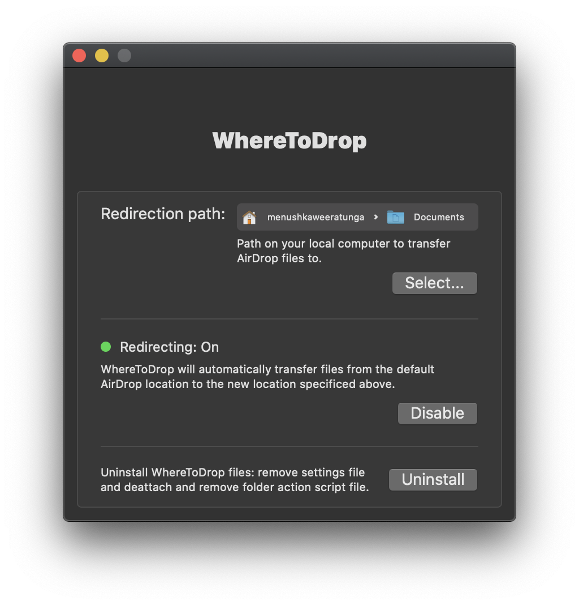

<h1 align="center">
  <br>
  <!--  -->
  <p style="margin: 10px; padding: 0px; font-weight: 600">WhereToDrop</p>
</h1>

<h4 align="center" style="margin: 10px">
    A small utility tool to redirect AirDrop files to another location on your Mac
</h4>

<h4 align="center">


</h4>

<p align="center">
  <a href="#build-instructions">Build Instructions</a> •
  <a href="#built-with">Built With</a> •
  <a href="#license">License</a>
</p>

<div align="center">
  
</div>

---

## Build Instructions

First install XcodeGen, the tool that generates the Xcode project (I recommend using Homebrew):
```bash
brew install xcodegen
```

Next launch the newly generated project
```bash
open *.xcodeproj
```

Finally press Run 🎉 🎉

## Built With

This software uses the following projects:

- [Swift](https://www.swift.com/)
- [Yams](https://github.com/jpsim/Yams)
- [XcodeGen](https://github.com/yonaskolb/XcodeGen)

## License

This project is licensed under the GNU GPLv3 License - see the [LICENSE.md](LICENSE.md) file for details
